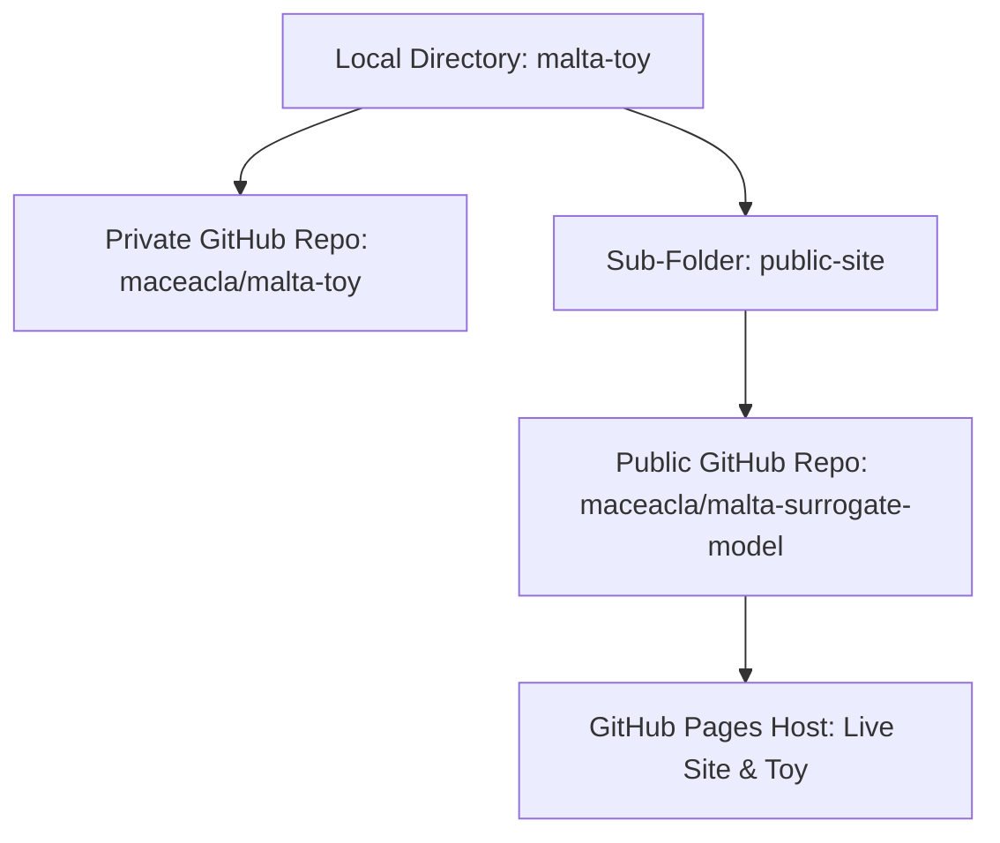

# MALTA2 Boundary-Loss Surrogate: Developer Handover & Context Guide

> [!NOTE]
> **To the AI Assistant:** Read this document to instantly bootstrap your understanding of the physics, mathematics, codebase architecture, and latest visual layout refinements for this project.

---

## 1. Scientific & Physics Context

### 1.1 The Research Paper
The project interactively models and generalized **Figure 13** of the research paper: *“The OR-merging boundary-loss surrogate for pixel detector geometries”* (focusing on the **MALTA2** silicon pixel detector).

### 1.2 The Mathematical Model
Silicon pixel detectors group individual pixels into digital clustering units of size $N_x \times N_y$. Optimizing this aspect ratio is a balancing act between physical space boundaries and timing degradation. The raw surrogate boundary-loss is defined as:

$$\Phi(N_x, N_y) = \frac{L_x \, p_x}{N_x} + \frac{L_y \, p_y}{N_y}$$

Where:
*   $N_x, N_y$: Cluster dimensions (number of pixels horizontally and vertically).
*   $p_x, p_y$: Directional coincidence probabilities (detector physics kernels).
*   $L_x, L_y$: Signal transmission survival rates (capturing timing, signal cuts, or encoding limitations).
*   $\rho = p_y / p_x$: Coincidence anisotropy factor.
*   $\chi = L_x / L_y$: Survival anisotropy ratio (timing cut impact).

### 1.3 Key Physics Regimes
1.  **Isotropic Regime ($\chi = 1.0$)**:
    Symmetric coincidence and signal survival. The continuous optimal aspect ratio profile sits perfectly at a square layout ($Y = \log_2(N_y/N_x) = 0 \implies 8\times8$).
2.  **Survivable-X Regime ($\chi \le 0.25$)**:
    Symmetric vertical tracking cuts heavily suppress survival rates for narrow layout geometries. In the Advanced MALTA2 model, when transitioning from $N_x = 4$ to $N_x = 2$, horizontal survival ($L_x$) drops sharply from $1.00$ to $0.53$ due to severe timing cuts.
    *   **The "Nose-Bending" Curve:** Because horizontal signals are heavily timing-suppressed at $N_x < 4$, the continuous loss curves bend backwards (moving leftward on the horizontal axis) before resuming their normal path. This proves mathematically that tall layouts (such as $2\times32$) are noise-cleaner than square-ish geometries (like $4\times16$).

---

## 2. Codebase & Repository Architecture

This project is set up as a **double-repository structure** on GitHub under the user `maceacla`:



### 2.1 Private Codebase Repository
*   **Local Directory:** `/Users/maceachern/Documents/_WIP_Random/malta-toy`
*   **Remote Origin:** `https://github.com/maceacla/malta-toy.git` (Private)
*   **Key Files:**
    *   `index.html`: The core interactive simulation dashboard.
    *   `malta2_epjc_v55_paper.pdf`: The original reference research paper.
    *   `HANDOVER.md`: This file (persists context across machines).

### 2.2 Public Presentation & Host Repository
*   **Local Directory:** `/Users/maceachern/Documents/_WIP_Random/malta-toy/public-site`
*   **Remote Origin:** `https://github.com/maceacla/malta-surrogate-model.git` (Public)
*   **Live Webpage:** [https://maceacla.github.io/malta-surrogate-model/](https://maceacla.github.io/malta-surrogate-model/)
*   **Key Files:**
    *   `index.html`: A premium dark-themed, glassmorphism research overview landing page introducing the boundary-loss model and containing the primary action button to launch the simulator.
    *   `toy.html`: The copied, self-contained interactive dashboard (synced from the private `index.html`).

---

## 3. Technical Implementation & Gotchas

To pick up development or maintain the page, keep these critical custom features and implementations in mind:

### 3.1 C¹ Hermite Smoothstep Curve Interpolation
In Advanced MALTA2 mode, horizontal survival ($L_x$) drops off between $N_x=4$ and $N_x=2$. Piecewise linear interpolation created sharp, non-physical cusps at continuous curve boundaries.
To ensure perfect $C^1$ continuity, we use a standard Hermite smoothstep interpolation inside the `getLx()` function:

```javascript
// Hermite Smoothstep: t^2 * (3 - 2t)
let t = (Nx - 2) / (4 - 2);
let smooth = t * t * (3 - 2 * t);
let Lx = L_x_2 + smooth * (1.0 - L_x_2);
```

### 3.2 Dynamic Auto-Scaling & Margin Engine
The continuous curves and markers dynamically shift horizontally depending on the slider values. Rather than using static Plotly range constraints (which clip labels at extreme parameters), `renderAll()` loops through all plotted curves and markers on every render cycle to track the global minimum and maximum normalized loss:

```javascript
let minX = Infinity;
let maxX = -Infinity;
// (Updates during curve and marker evaluation loops)
let padding = (maxX - minX) * 0.12; // 12% padding boundary
let layout = {
  xaxis: { range: [minX - padding, maxX + padding] }
};
```

### 3.3 Dynamic State Preservation (URL Hashes)
The application automatically serializes the user’s slider and toggle values into a browser URL hash whenever a control changes, enabling instant state sharing and bookmarking:

```javascript
// Example state serialization
window.location.hash = `rho=${state.rho}&mode=${state.mode}...`;
```

### 3.4 Plotly Label Sizing & Color Gotcha
In Plotly scatter charts, labels mapped onto markers (`mode: 'markers+text'`) are styled via **`textfont`**, NOT `font`. Using the generic `font` property inside the trace object causes Plotly to ignore your font properties:

```javascript
// CORRECT TRACE TEXT LABEL PROPERTY
textfont: {
  family: 'Inter, sans-serif',
  size: 12,
  color: state.theme === 'dark' ? '#ffffff' : '#475569'
}
```

---

## 4. Current Default Settings & Styling Reference

As of the latest updates, the default load state (`#` hash absent) is set to:
*   **Active Group Areas:** Checkboxes default strictly to **`A = 16`** and **`A = 64`** active (others are unchecked).
*   **Physics Settings:** `Simple Mode` active, coincidence anisotropy $\rho = 1.0$, survival anisotropy $\chi = 1.0$.
*   **Layout Elements:**
    *   **"⬅ Back to Article" Button:** Located in the top header, styled with glassmorphism matching the dark/light toggle, linking back to `index.html`.
    *   **Geometry Point Label size:** Sized up to **`12`**.
    *   **Label Font Color in Dark Mode:** Set to bright **`#ffffff` (white)** for premium high-contrast visibility.
    *   **Marker Symbol Sizes:** Standard geometry points set to **`11`**; MALTA2 special reference diamonds set to **`16`**.
